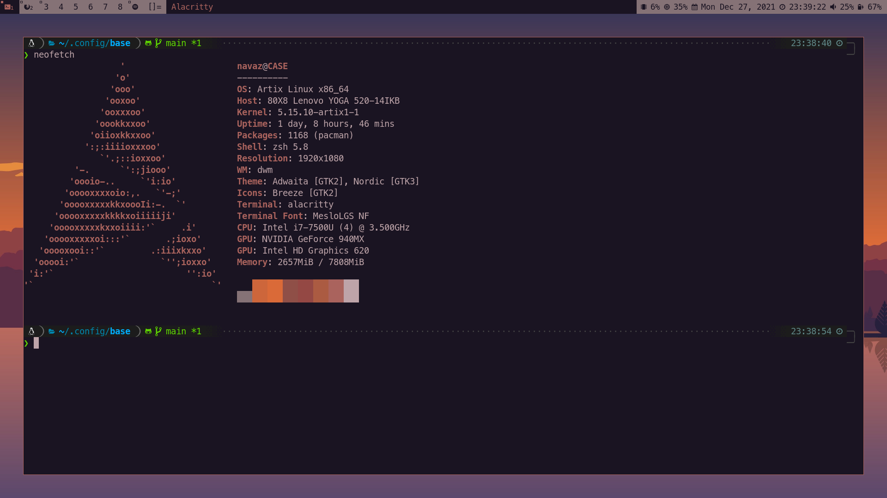

# Base Configuration

This repository contains my Arch/Artix build.
It is set up so that it can bootstrap a bare installation of Arch/Artix (in
general, this should work if `pacman` is available).



## Setup

Clone this repository (and submodules) into the `~/.config`:

```bash
mkdir -p ~/.config
git --recurse-submodules clone https://github.com/navaz-alani/base.git ~/.config/base
```

Do not rename it as the name is used in some of the configuration.

After cloning, just run `make bootstrap` to

* install the dependencies (see `setup/install-deps` script)
* compile & install `dwm`, `dwmstat`, `st`
* link up various application configs
* set-up zsh (see `setup/zsh-setup` script); this currently just installs a
  nice poweline theme, but I plan to get plugins working
* set-up the pleasant Nordic GTK theme system-wide (and Breeze cursor set)

After the `make` step is successfully completed, your shell will have been
changed to `zsh`.
You need to re-login for certain environment variables to be set-up properly
and all the scripts to work as expected.

After re-logging-in, running `startx` in a TTY should bring up a graphical
environment, the details of which are discussed later.
If you have any problems, on the initial `startx` invocation, try restart your
machine OR ensure that the drivers for your graphics card have been installed
(this setup process does not attempt to do that!).
See [here](https://wiki.archlinux.org/title/Xorg#Driver_installation) for more
information on driver installation (tip: use `neofetch` to name the installed
graphics card).

__NOTE__: `startx` is aliased to point to the `xinitrc` configuration, which is
intentionally not located in the home directory to prevent clutter.
You can find the `xinitrc` file at `config/x11/xinitrc`.

## Build Details

At a high level, this build uses the following major programs

* (patched) `dwm` as the window manager
* (custom) `dwmstat` as the status bar
* (patched) `st` as the terminal emulator (`st` has some cool features, but
  `alacritty` is also installed - it seems to render glyphs better and,
  honestly, is much easier to customize)
* `rofi` as the application launcher, list selection utility, etc.

### [`dwm`](https://dwm.suckless.org)

The `Mod` key for `dwm` is set to the Super (windows) key, because combinations
of the default mod key Alt are used by programs like Firefox.

This `dwm` build has been patched with the following additional functionality
* `xrdb` patch, which enables `dwm` to read colors from the `Xresources` at
  runtime.
  This allows `dwm`'s theme to be changed dynamically e.g. when the background
  is changed (more on this later).
* `gaps` patch, which allows a margin to windows to make the setup more
  visually pleasant.
  Use `Mod+Plus` and `Mod+`
* `shift-tools` patch, which allows shifting through tags and much more.
  See [here](https://dwm.suckless.org/patches/shift-tools/) for more
  information.
* `pertag` patch keeps layout, mwfact (master width factor), barpos (bar
  position) and nmaster (number of master windows) per tag.
* `moveresize` patch which allows moving and resizing floating windows using
  the keyboard.

#### Keybindings

This is a (probably not comprehensive) list of the keybindings in this `dwm`
build.

* __Go to tag__: `Mod+[num]` where `num` is the tag number
* __Shift between tags__: `Mod+i` and `Mod+o` shift to the previous and next
  tags respectively 
* __Toggle bar__: `Mod+b` toggles the top bar
* __Window navigation__: Use `Mod+j` and `Mod+k` to navigate windows on a tag.
    Note that this only changes focus, use `Mod+Enter` to swap the focused
    window in the stack and the master window.
    This is layout-independent.
* __Full-screen a window__: `Mod+Shift+f`.
  This operation is its own inverse.
* __Kill window__: To kill the program running in a window, run `Mod+Shift+C`.
* __Kill `dwm`__: To kill `dwm` (maybe to test your changes), run
  `Mod+Shift+Q`.
  Note that this will kill all running programs.
* __Layouts__

  * `Mod+t` switches to the tiled layout.
    In this layout, there are two main components: the master window and the
    window stack.
    There is a single master window (this can be changed, but is disabled in
    this build) and the rest of the windows are placed in a window stack which
    appears to the right of the master window.

    Use `Mod+h` and `Mod+l` to reduce and increase the master window's width
    factor respectively.
  * `Mod+f` switches to the floating layout.
    This layout is the default one on MacOS/Windows, and requires manual window
    management, which may be necessary (and more convenient) for some programs
    such as Gimp and Firefox.

    A floating window can be moved around by holding `Mod` and using the mouse
    to click and move it around.
    There are also keybindings for this - which may be considerably faster than
    using the mouse/trackpad.
    In the following keybindings, let `dir` be a direction inputted by the
    arrow keys (`UP`, `DOWN`, `LEFT`, `RIGHT`).

    * Use `Mod+[dir]` to move a floating window around.
    * Use `Mod+Shift+[dir]` to increase/decrease the floating window's
      dimensions.
    * Use `Mod+Ctrl+[dir]` to move the floating window's the maximum amount in
      `dir`.
      For example, `Mod+Ctrl+UP` will move the window so it's top border is at
      the top of the screen.
    * Use `Mod+Ctrl+Shift+[dir]` to increase the window's border the maximum
      amount in direction `dir`.
      For example, `Mod+Ctrl+Shift+DOWN` will move the window's bottom border
      all the way to the bottom of the screen.

  * `Mod+m` switches to the monocle layout.
    This layout stacks the windows on top of each other, master being on the
    top (visible) and the rest being beneath.

* __Move window to tag__: `Mod+Shift+[num]` where `num` is the tag number.
  This moves the selected window to tag `num`.
* __Make window floating__: Focus on a window and press `Mod+Shift+Space` to
  make it floating, while maintaining the tag's layout.
* __Show widow on every tag__: Focus on a window and press `Mod+Shift+0` to
  make it appear on every tag.
  If you want to stop a window from appearing on every tag, explicitly move it
  to a particular tag (`Mod+Shift+[num]`).
  
  __NOTE__: the previous 3 bindings can be used to create a proper
  picture-in-picture window (one that appears on every tag, in  the same
  position).
  Focus on a picture-in-picture window, press `Mod+Shift+Space` to make it
  floating.
  Then, press `Mod+Shift+0` to make it appear on every tag.
  You can then use the keybindings for floating windows to resize/move the
  picture-in-picture window around.
* __Additionally show window on specific tag__: Focus on a window and press
  `Mod+Ctrl+Shift+[num]` where `num` is the tag number.
  This adds the window to tag `num` as well as the tag it's currently in.
  This operation is its own inverse.

### [`st`](https://st.suckless.org)

In this `st` build, the `Mod` key is `Alt` and the `Termmod` is `Ctrl+Shift`.

This `st` build has been patched with the following additional functionality.

* `xresources` patch, which enables `st` to read colors from the `Xresources`.
  This allows `st`'s theme to be changed dynamically e.g. when the background
  is changed (more on this later).
* `dynamic-color-cursor` patch which helps to make the cursor more visible.
* `vim_browse` patch which adds scroll-back and a Vim-like normal mode (to move
  through scroll-back, select and yank to clipboard).

#### Keybindings

* __Font size__: Use `Ctrl+equals` and `Ctrl+minus` to increase and decrease
  the font size respectively.
  Use `Termmod+Esc` to reset the font size to default.
* __Scroll-back navigation__: Press `Mod+c` to enter a Vim-like environment
  where navigation through the scroll-back buffer is possible using normal Vim
  keys.
  Selected text can be copied to the clipboard by yanking it.
  Mouse scrolling will not move through the scroll-back buffer.
  See [here](https://st.suckless.org/patches/vim_browse/) for more information.
* __Copy Paste__: `Termmod+v` pastes clipboard contents and `Termmod+c` copies
  selected text to the clipboard.

## Misc

### Keybindings

* `Super+p` brings up `rofi` to select an application to run.
* `Super+Shift + b` brings up a background selection utility.
* `Super+Ctrl+Shift + b` selects a random background and sets it.
* `Super+Ctrl + s` brings up a screenshotting utility.

Keybindingds can be added through in the `config/.xbindkeysrc` file.

### Screenshotting (`screenshot` and `view-screenshots`)

A simple script called `screenshot`, which can be launched using `Super+Ctrl+s`
brings up `rofi` to enable the user to select between "Screen", "Window" and
"Selection" modes of taking a screenshot (which are pretty self explanatory).

Note, however, that "Window" mode takes a sceenshot of the currently focused
window, so make sure you focus on the window before taking  the screenshot!

Screenshots are stored in the `SCREENSHOTS_DIR` directory, which by default is
set to `~/media/screenshots` and named
`screenshot-[DD]_[MM]_[YY]-[hh]:[mm]:[ss].png`.
These can be changed by editing the `cfg` file and the `screenshot` script
respectively.

To view captured screenshots, the `view-screenshot` script can be used (launch
it using `rofi`, or if you frequently use it, make a key-binding for it).

### Changing Desktop Background (`chbg`)

By default, when `startx` is run, a new random background is set (`chbg rand`).
A color-scheme (based on the selected background) is generated which, programs
getting their colors from `Xresources` can use.
So `dwm` and `st` will automatically obey this color scheme.

Backgrounds are stored in the `backgrounds` directory.
You can add your own there.

When you run `chbg choose`, a thumbnail list of all the backgrounds in the
backgrounds directory will be brought up in `sxiv`.
You can use `Enter` to maximize a thumbnail and `Enter` again to minimize it.
Vim keys `h, j, k, l` can be used to move around the thumbnail list.
To set an image as the background, focus on its thumbnail and press `Ctrl+x+w`
in quick succession.

### Conventions

* All scripts in the `scripts` directory which begin with `sb_` are for use
  with the status bar.

### TODO

- [ ] ACPI handling (so the system doesn't power off when power button is clicked)
- [ ] Handle audio events e.g. headphones plugged in and refresh bar
- [ ] Work on a dwm patch to inform status bar module where it was clicked
- [ ] zsh plugins
